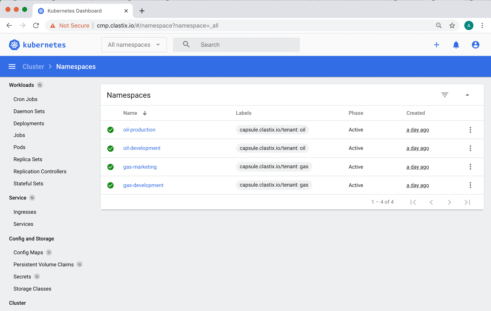

# Kubernetes Dashboard

This guide describes how to integrate the [Kubernetes Dashboard](https://kubernetes.io/docs/tasks/access-application-cluster/web-ui-dashboard/) and [Capsule Proxy](https://capsule.clastix.io/docs/general/proxy/) with OIDC authorization.

In this guide, we will use [Keycloak](https://www.keycloak.org) as the Identity Provider.



## Configuring oauth2-proxy

To enable the proxy authorization from the Kubernetes dashboard to Keycloak, we need to use an OAuth proxy.
In this article, we will use [oauth2-proxy](https://oauth2-proxy.github.io/oauth2-proxy/) and install it as a pod in the Kubernetes Dashboard namespace.
Alternatively, we can install `oauth2-proxy` in a different namespace or use it as a sidecar container in the Kubernetes Dashboard deployment.

Prepare the values for oauth2-proxy:
```bash
cat > values-oauth2-proxy.yaml <<EOF
config:
  clientID: "${OIDC_CLIENT_ID}"
  clientSecret: ${OIDC_CLIENT_SECRET}

extraArgs:
  provider: "keycloak-oidc"
  redirect-url: "https://${DASHBOARD_URL}/oauth2/callback"
  oidc-issuer-url: "https://${KEYCLOAK_URL}/auth/realms/${OIDC_CLIENT_ID}"
  pass-access-token: true
  set-authorization-header: true
  pass-user-headers: true

ingress:
  enabled: true
  path: "/oauth2"
  hosts:
    - ${DASHBOARD_URL}
  tls:
    - hosts:
      - ${DASHBOARD_URL}
EOF
```

> Values used for the config:
> 
> - **OIDC_CLIENT_ID**: the keycloak client ID (name) which user in Kubernetes API Server for authorization
> - **OIDC_CLIENT_SECRET**: secret for the client (`OIDC_CLIENT_ID`). You can see it from the Keycloack UI -> Clients -> `OIDC_CLIENT_ID` -> Credentials
> - **DASHBOARD_URL**: the Kubernetes Dashboard URL
> - **KEYCLOAK_URL**: the Keycloak URL

More information about the `keycloak-oidc` provider can be found on the [oauth2-proxy documentation](https://oauth2-proxy.github.io/oauth2-proxy/docs/configuration/oauth_provider/#keycloak-oidc-auth-provider).

We're ready to install the `oauth2-proxy`:

```bash
helm repo add oauth2-proxy https://oauth2-proxy.github.io/manifests
helm install oauth2-proxy oauth2-proxy/oauth2-proxy -n ${KUBERNETES_DASHBOARD_NAMESPACE} -f values-oauth2-proxy.yaml
```

## Configuring Keycloak

The Kubernetes cluster must be configured with a valid OIDC provider: for our guide, we're giving for granted that Keycloak is used, if you need more info please follow the [OIDC Authentication](/docs/guides/oidc-auth) section.

In a such scenario, you should have in the `kube-apiserver.yaml` manifest the following content:
```yaml
spec:
  containers:
  - command:
    - kube-apiserver
    ...
    - --oidc-issuer-url=https://${OIDC_ISSUER}
    - --oidc-ca-file=/etc/kubernetes/oidc/ca.crt
    - --oidc-client-id=${OIDC_CLIENT_ID}
    - --oidc-username-claim=preferred_username
    - --oidc-groups-claim=groups
    - --oidc-username-prefix=-
```

Where `${OIDC_CLIENT_ID}` refers to the client ID that all tokens must be issued.

For this client we need:
1. Check `Valid Redirect URIs`: in the `oauth2-proxy` configuration we set `redirect-url: "https://${DASHBOARD_URL}/oauth2/callback"`, it needs to add this path to the `Valid Redirect URIs`
2. Create a mapper with Mapper Type 'Group Membership' and Token Claim Name 'groups'.
3. Create a mapper with Mapper Type 'Audience' and Included Client Audience and Included Custom Audience set to your client name(OIDC_CLIENT_ID).

## Configuring Kubernetes Dashboard

If your Capsule Proxy uses HTTPS and the CA certificate is not the Kubernetes CA, you need to add a secret with the CA for the Capsule Proxy URL.
```bash
cat > ca.crt<< EOF
-----BEGIN CERTIFICATE-----
...
...
...
-----END CERTIFICATE-----
EOF

kubectl create secret generic certificate --from-file=ca.crt=ca.crt -n ${KUBERNETES_DASHBOARD_NAMESPACE}
```

Prepare the values for the Kubernetes Dashboard:
```bash
cat > values-kubernetes-dashboard.yaml <<EOF
extraVolumes:
  - name: token-ca
    projected:
      sources:
        - serviceAccountToken:
            expirationSeconds: 86400
            path: token
        - secret:
            name: certificate
            items:
              - key: ca.crt
                path: ca.crt
extraVolumeMounts:
  - mountPath: /var/run/secrets/kubernetes.io/serviceaccount/
    name: token-ca

ingress:
  enabled: true
  annotations:
    nginx.ingress.kubernetes.io/auth-signin: https://${DASHBOARD_URL}/oauth2/start?rd=$escaped_request_uri
    nginx.ingress.kubernetes.io/auth-url: https://${DASHBOARD_URL}/oauth2/auth
  hosts:
    - ${DASHBOARD_URL}
  tls:
    - hosts:
      - ${DASHBOARD_URL}

extraEnv:
  - name: KUBERNETES_SERVICE_HOST
    value: '${CAPSULE_PROXY_URL}'
  - name: KUBERNETES_SERVICE_PORT
    value: '${CAPSULE_PROXY_PORT}'
EOF
```

To add the Certificate Authority for the Capsule Proxy URL, we use the volume `token-ca` to mount the `ca.crt` file.
Additionally, we set the environment variables `KUBERNETES_SERVICE_HOST` and `KUBERNETES_SERVICE_PORT` to route requests to the Capsule Proxy.

Now you can install the Kubernetes Dashboard:

```bash
helm repo add kubernetes-dashboard https://kubernetes.github.io/dashboard/
helm install kubernetes-dashboard kubernetes-dashboard/kubernetes-dashboard -n ${KUBERNETES_DASHBOARD_NAMESPACE} -f values-kubernetes-dashboard.yaml
```
